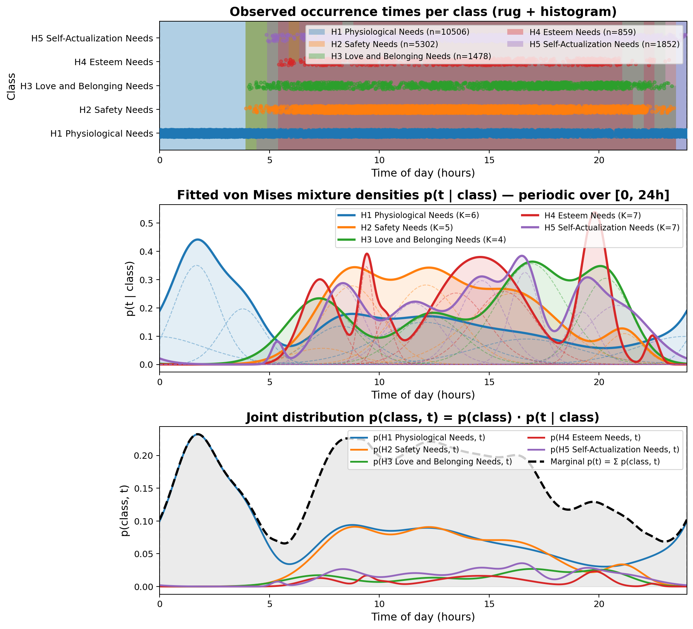
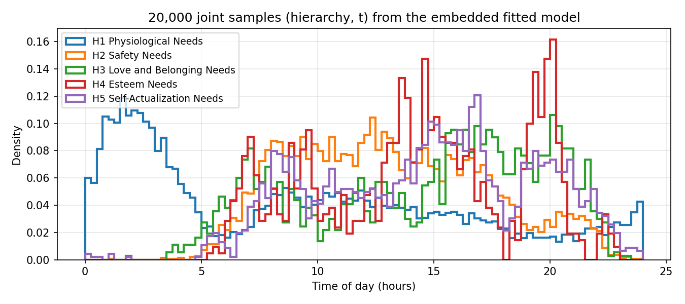
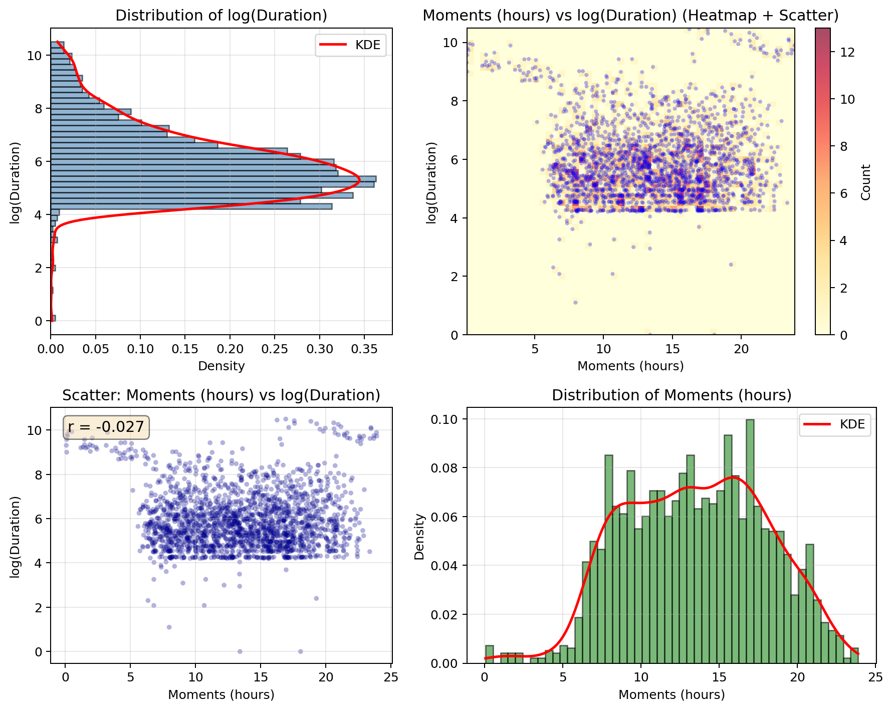
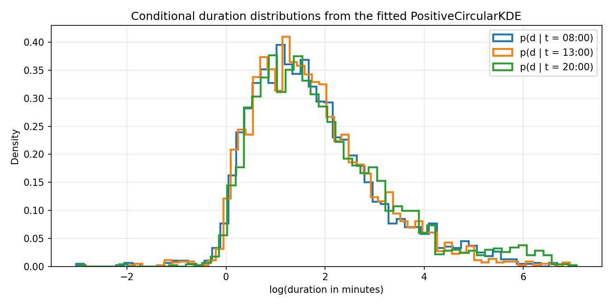

Examples: the fitted von Mises mixture model
=============================================

The plots below are produced directly from the embedded assets of
:mod:`pymaslow.vonMisesMixture` — no external data is required. The model
is fitted on the KDE-resampled CAPTURE-24 occurrence times of the five
Maslow need hierarchies.

Fitted joint model
------------------

.. code-block:: python

   from pymaslow import vonMisesMixture as vmmm

   fig, axes = vmmm.plot_vmmm_results(
       vmmm.data, vmmm.p_x, vmmm.models, vmmm.best_k, figsize=(11, 10)
   )

The three panels show (top) the observed occurrence times per hierarchy,
(middle) the fitted conditional densities :math:`p(t \mid \text{hierarchy})`
with their individual mixture components dashed, and (bottom) the joint
distribution :math:`p(\text{hierarchy}, t)` with the marginal :math:`p(t)`.
Physiological needs (H1) concentrate around mealtimes and the night,
safety needs (H2) dominate working hours, and the higher-order needs
(H3–H5) rise in the evening.

Sampling from the fitted model
------------------------------

.. code-block:: python

   classes, times = vmmm.sample_joint_vmmm(
       vmmm.p_x, vmmm.models, n_samples=20000, seed=42
   )

Joint samples are drawn by first sampling a hierarchy from the fitted
prior :math:`p(\text{hierarchy})` and then a time of day from the
corresponding conditional mixture — the sampled class frequencies match
``vmmm.p_x`` and the per-histogram shapes reproduce the fitted
conditional densities.

Durations and time of day
--------------------------

The :mod:`pymaslow.durations` module models the joint distribution of
activity durations and their time of day on the embedded CAPTURE-24
duration table (``durations.data``). The 2x2 overview grid is produced by:

.. code-block:: python

   from pymaslow import durations

   fig, axes = durations.plot(log_duration=True, figsize=(10, 8))

Fitting the positive circular KDE (log-normal kernel for durations, von
Mises kernel for the circular time axis) yields conditional duration
distributions at any time of day:

.. code-block:: python

   model = durations.fit()
   samples = model.sample_conditional(8.0, n_samples=3000, random_state=42)

With the default ``fit(log_duration=True)`` the model works on the
log-duration scale; exponentiating the samples converts them back to
seconds.
